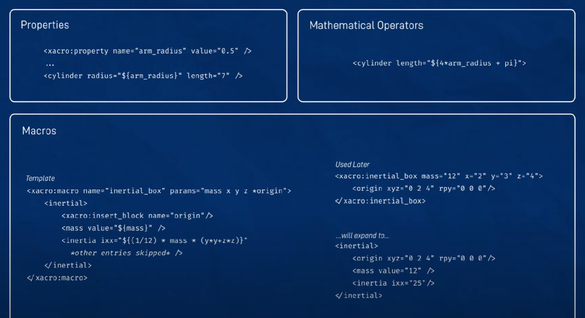

# URDF - Unified Robot Description Format
> URDF is an XML format for representing a robot model (file extension .urdf)  

ROS2 documentation:
[Buildng a visual robot model from scratch](https://docs.ros.org/en/rolling/Tutorials/Intermediate/URDF/Building-a-Visual-Robot-Model-with-URDF-from-Scratch.html)

URDF tutorial (Learning URDF Step by Step) [urdf_tutorial](https://github.com/ros/urdf_tutorial/tree/ros2) NB! this package depends on the package urdf_launch  
`ros2 launch urdf_tutorial display.launch.py model:=urdf/01-myfirst.urdf` - visualize your urdf model in rviz  
[urdf_launch](https://github.com/ros/urdf_launch) This package contains launch files and configurations for common URDF operations (launches robot_state_publisher, joint_state_publisher, rviz)

- link is a rigid body with inertia (urdf example: `<link name="base_link">`)
- joint is a connection between two links
- joint origin tag defines the pose of the joint relative to the parent link (urdf example: `<origin xyz="0 0 0" rpy="0 0 0"/>`)
- joint types are:
  - fixed (no movement) (e.g. between base_link and odom) (urdf example: `<joint name="base_to_odom" type="fixed">`)
  - continuous (revolute with no limits)
  - revolute (rotational) ()
  - prismatic
  - floating
  - planar
- transmission is a connection between a joint and an actuator

  <figure>
    
  </figure>
  <figure>
    
  </figure>
  <figure>
    
  </figure>

## XACRO - XML Macros for URDF
Files with extension .xacro are XML files that can contain macros. Macros are used to simplify the creation of URDF files.

`xacro myrobot.urdf.xacro > myrobot.urdf` - convert xacro file to urdf file

<!--  -->

> Kinematics is the study of motion without considering the forces that cause the motion.  
> **Inverse kinematics** is the process of determining the parameters of a jointed flexible  
> object (e.g. a robot arm) necessary to place the end of the object in a given position and orientation.  
> **Forward kinematics** is the process of determining the position and orientation of the end of a jointed flexible  
> object (e.g. a robot arm) given the parameters of the joints. Inverse kinematics is more difficult  
> than forward kinematics because there are multiple possible solutions to the problem. For example, a robot arm  
> with 3 joints has 3 degrees of freedom. If the end of the arm is at a given position and orientation, there are multiple  
> possible configurations of the joints that could result in the same position and orientation of the end of the arm.  

- kinematic chain is a set of links connected by joints
- serial manipulator is a kinematic chain with a single end-effector (e.g. robot arm)

  <figure>
    
    <figcaption>Cartesian space</figcaption>
  </figure>
  <figure>
    
    <figcaption>Forward kinematics</figcaption>
  </figure>
  <figure>
    
    <figcaption>Inverse kinematics</figcaption>
  </figure>

> Pose = Position + Orientation 
> Position = (x, y, z)
> Orientation = (roll, pitch, yaw)